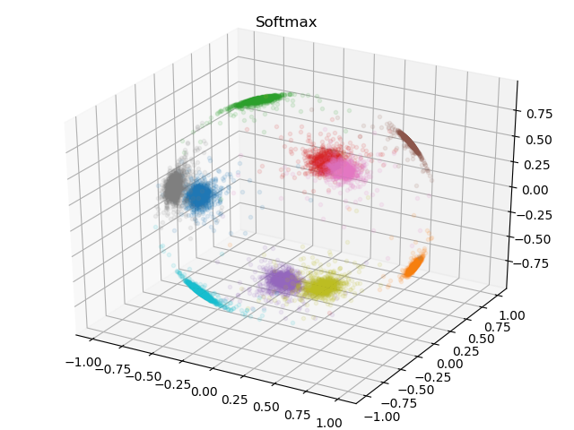
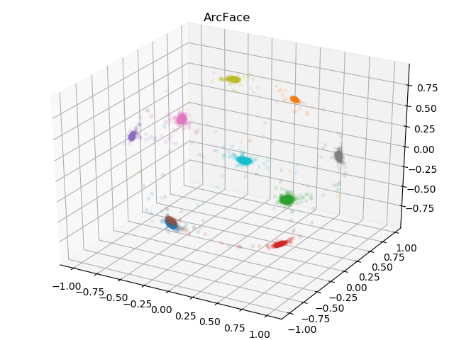
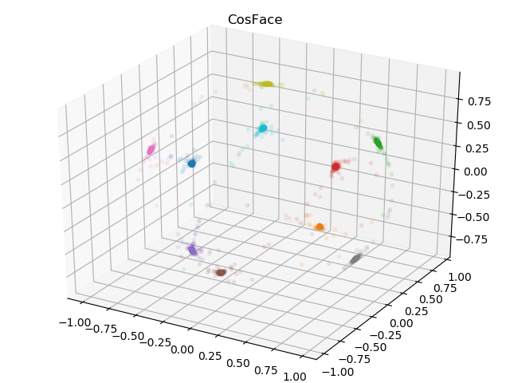
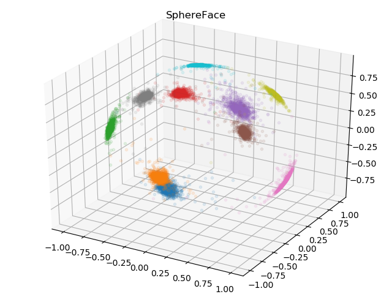

# Keras implementation of ArcFace, CosFace, and SphereFace
This repository contains code for **ArcFace**, **CosFace**, and **SphereFace** based on [ArcFace: Additive Angular Margin Loss for Deep Face Recognition](https://arxiv.org/abs/1801.07698) implemented in Keras.

## Requirements
- Python 3.6
- Keras 2.2.4

## Usage
### Train
```python
input = Input(shape=(28, 28, 1))
label = Input(shape=(10,))

x = Conv2D(32, kernel_size=(3, 3), activation='relu')(input)
x = MaxPooling2D(pool_size=(2, 2))(x)
x = Conv2D(64, kernel_size=(3, 3), activation='relu')(x)
x = MaxPooling2D(pool_size=(2, 2))(x)

x = BatchNormalization()(x)
x = Dropout(0.5)(x)
x = Flatten()(x)
x = Dense(512, kernel_initializer='he_normal')(x)
x = BatchNormalization()(x)
output = ArcFace(n_classes=10)([x, label])

model = Model([input, label], output)

model.compile(loss='categorical_crossentropy',
              optimizer=Adam(),
              metrics=['accuracy'])

model.fit([x_train, y_train],
          y_train,
          batch_size=batch_size,
          epochs=epochs,
          verbose=1,
          validation_data=([x_test, y_test], y_test),
          callbacks=[ModelCheckpoint('model.hdf5',
                     verbose=1, save_best_only=True)])
```

### Test
```python
model.load_weights('model.hdf5')
model = Model(inputs=model.input[0], outputs=model.layers[-3].output)
embedded_features = model.predict(x_test, verbose=1)
embedded_features /= np.linalg.norm(embedded_features, axis=1, keepdims=True)
```

## Training
### MNIST
ArcFace:
```
python train.py --arch vgg8_arcface
```
CosFace:
```
python train.py --arch vgg8_cosface
```
SphereFace:
```
python train.py --arch vgg8_sphereface
```

## Results
### MNIST




